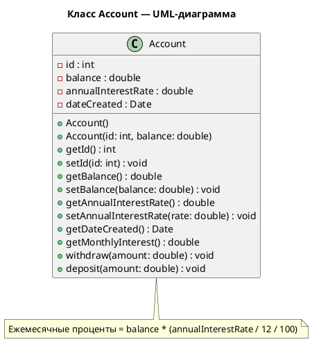

# 🏦 **LigmaBallZ Banking System**

### Команда: **CoolGaysTeam**

**Участники проекта:**

* 🧠 **Романов Дмитрий**
* ⚙️ **Кузнецов Владимир**
* 💻 **Саргас Кирилл**
* 🧩 **Петров Артём**
* 📊 **Федченко Кирилл**


## 📘 **Описание проекта**

Проект **LigmaBallZ Banking System** моделирует работу **банковского счёта** и простого **банковского приложения** с использованием принципов **объектно-ориентированного программирования (ООП)** и **системы контроля версий Git**.

Программа реализует базовую финансовую логику:

* создание банковского счёта;
* операции снятия и пополнения средств;
* начисление процентов;
* работу с датой создания счёта;
* интерактивный консольный интерфейс для пользователя.

---

## 🎯 **Цель проекта**

Создать обучающую модель банковского приложения, позволяющую:

* понять принципы работы с классами, методами и объектами в языке программирования;
* освоить модульную архитектуру и интеграцию компонентов;
* научиться работать в команде с использованием Git и параллельной разработки.

---

## 🧩 **Функциональность**

1. Создание банковского счёта (`Account`) с полями:

   * `id`, `balance`, `annualInterestRate`, `dateCreated`;
2. Расчёт ежемесячного процента по вкладу;
3. Снятие (`withdraw`) и пополнение (`deposit`) средств;
4. Работа с консольным меню:

   * просмотр баланса;
   * внесение / снятие денег;
   * выход в выбор ID;
5. Моделирование 10 банковских аккаунтов (ID от `0` до `9`) с базовым балансом `10000 руб.`;
6. Проверка корректности ID и циклическая работа программы (без выхода после одной сессии).

---

## 🧠 **Структура проекта**

```plaintext
LigmaBallZ/
│
├── src/
│   ├── Account.java        # Основной класс банковского счёта
│   ├── BankApp.java        # Главный консольный интерфейс
│   ├── AccountsManager.java # Модуль моделирования нескольких счетов
│
├── uml/
│   └── AccountDiagram.puml # UML-диаграмма класса Account
│
├── tests/
│   └── AccountTest.java     # Тестирование методов класса Account
│
└── README.md
```

---

## 📊 **Задание**

### Задача:

Разработать программу, которая **моделирует банковский счёт**:

* создание счёта с указанными **идентификатором** и **балансом**;
* присваивание **годовой процентной ставки**;
* получение **даты создания** счёта;
* начисление **ежемесячного процента**;
* операции **снятия** и **пополнения**;
* реализация **меню взаимодействия с пользователем**;
* моделирование **10 банковских аккаунтов** с проверкой корректности ввода ID.

---

## ⚙️ **Разделение проекта по участникам**

|   №   | Подзадание                                | Участники                                        | Роль / Задачи                                                                        |
| :---: | ----------------------------------------- | ------------------------------------------------ | ------------------------------------------------------------------------------------ |
| **1** | **Разработка класса `Account`**           | 🧠 **Романов Дмитрий**, ⚙️ **Кузнецов Владимир** | Разработка логики счёта, методов `withdraw()`, `deposit()`, `getMonthlyInterest()`.  |
| **2** | **Создание UML-диаграммы**                | 💻 **Саргас Кирилл**                             | Разработка визуальной модели класса `Account` в PlantUML и анализ архитектуры.       |
| **3** | **Интеграция модулей и тестирование**     | 📊 **Федченко Кирилл**, 🧩 **Петров Артём**      | Тестирование класса, создание примеров работы программы, проверка расчётов.          |
| **4** | **Разработка консольного интерфейса**     | ⚙️ **Кузнецов Владимир**, 💻 **Саргас Кирилл**   | Создание интерактивного CLI для взаимодействия с пользователем.                      |
| **5** | **Моделирование системы из 10 аккаунтов** | 🧠 **Романов Дмитрий**                           | Создание массива счетов, организация логики выбора ID и циклического взаимодействия. |

---

## 🧩 **UML-диаграмма класса `Account`**



---

## 🚀 **Как запустить проект**

1. Клонировать репозиторий:

   ```bash
   git clone https://github.com/CoolGaysTeam/LigmaBallZ.git
   cd LigmaBallZ
   ```
2. Скомпилировать проект (для Java):

   ```bash
   javac src/*.java -d bin
   ```
3. Запустить:

   ```bash
   java -cp bin BankApp
   ```
4. Следовать инструкциям в консоли.

---

## ✅ **Результаты**

После запуска пользователь может:

* выбрать счёт по ID;
* просмотреть баланс;
* снять или внести деньги;
* рассчитать ежемесячные проценты;
* вернуться к выбору аккаунта.

---

## 🧾 **Итог**

Проект демонстрирует:

* принципы объектно-ориентированного проектирования (ООП);
* модульность и командную разработку;
* практическое применение UML и Git;
* взаимодействие между объектами в системе банковского приложения.

---
